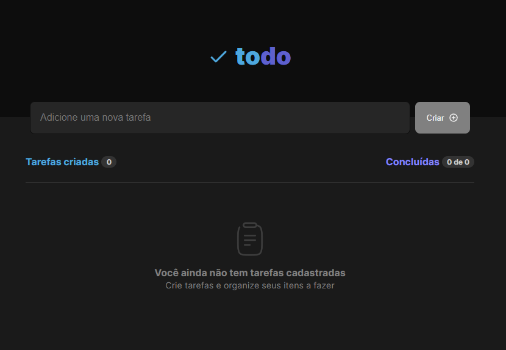

<h1 align="center">To-Do List</h1>

Let's create To-Do List using React/Typescript?

  <a href="#-technologies">Technologies</a>&nbsp;&nbsp;&nbsp;|&nbsp;&nbsp;&nbsp;
  <a href="#-project">Project</a>&nbsp;&nbsp;&nbsp;|&nbsp;&nbsp;&nbsp;  
  <a href="#-libraries">Libraries</a>&nbsp;&nbsp;&nbsp;|&nbsp;&nbsp;&nbsp;  
  <a href="#memo-license">License</a>

  

## 🚀 Technologies

This project was developed using the following technologies:

- JavaScript/Typescript
- [ReactJS](https://reactjs.org/)
- [Vite](https://vitejs.dev/)
- [Yarn](https://yarnpkg.com/)

## 💻 Project

This application is a To-Do List with the follwing features:

- [x] Create a To-Do List
- [x] Delete a To-Do List
- [x] Check as done
- [x] Validate To-Do List input

## ⚙️ Libraries

All the libraries this app is using:

- Phosphor-icons
- uuid
- React v18

## :memo: License

This project is under MIT License.

---

Developed with ♥ by [@giogama](https://instagram.com/giogama) :wave:
